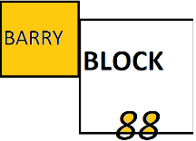
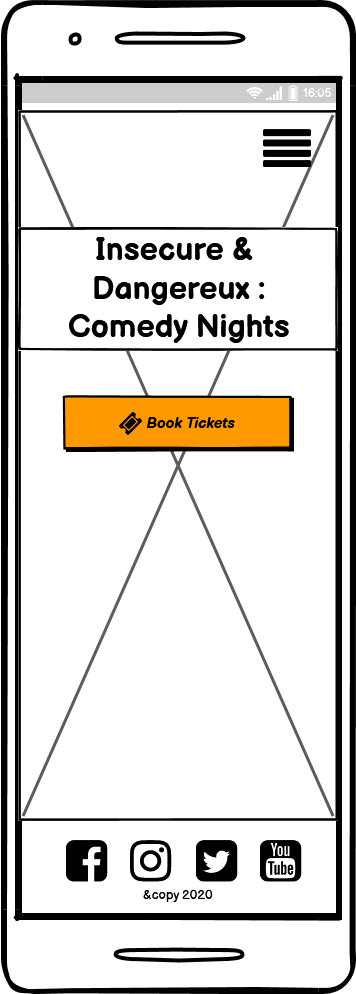
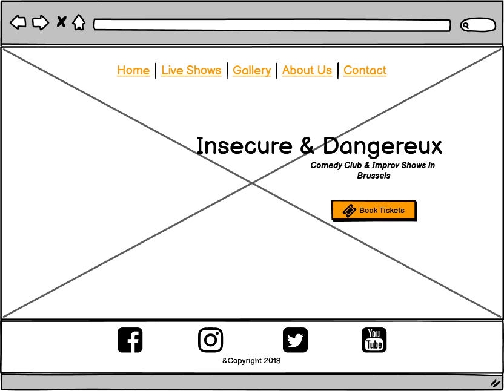
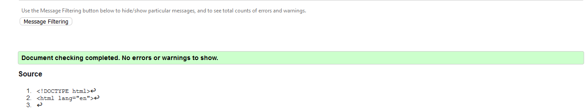
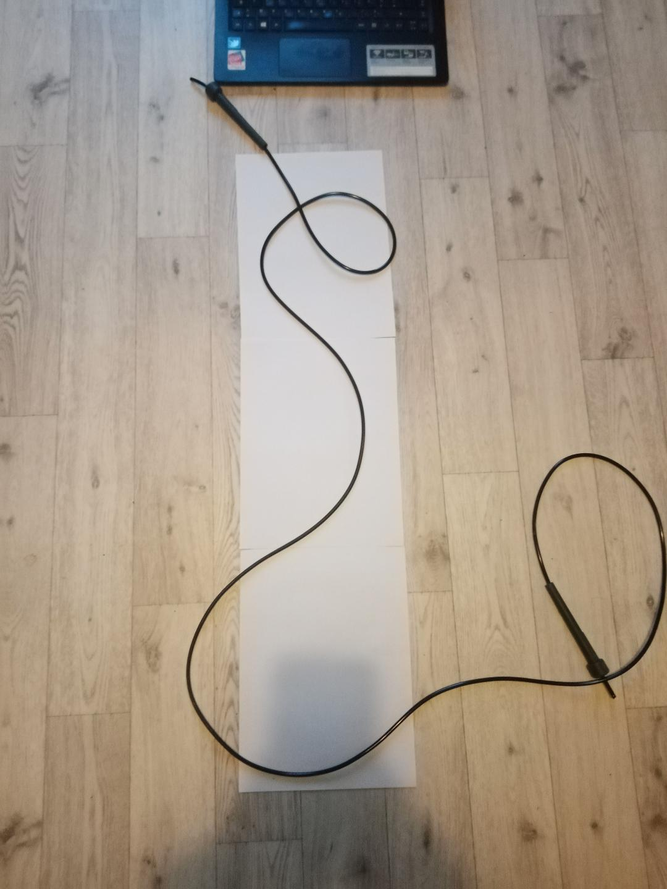
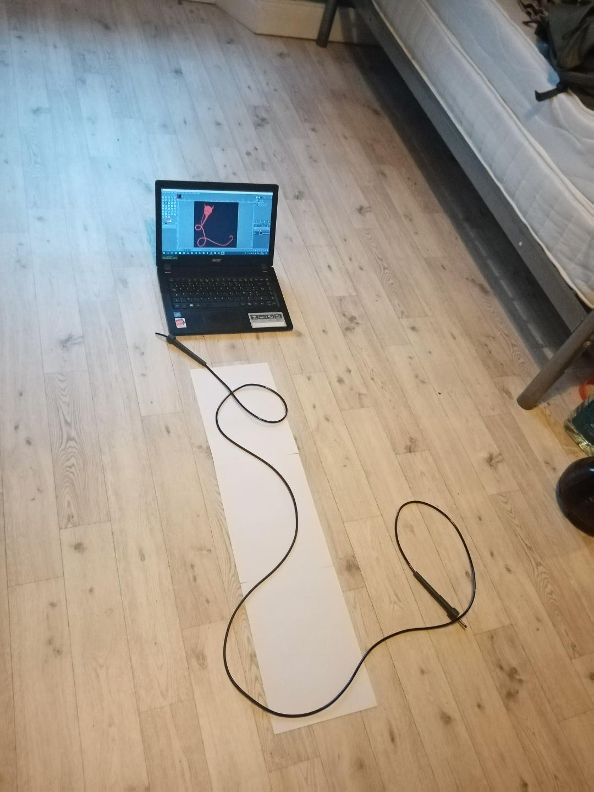

# Milestone_Project_one_
### Developer/Author - Barry Cullen
 

## This project (Milestone one) was completed as part of Code Institute's Full Stack Web Development course in 2020/21-

## Project Requirements:
-To create a frontend user-centric website with HTML5, CSS3 with the possible addition of frameworks such as Bootstrap.-

## Project Outline:
#### Insecure & Dangereux: Comedy Nights

- Insecure and Dangereux: Comedy Nights is a Comedy club specialising in English language Live stand up and improv events, throughout venues in Brussels, Belgium.

- It is an actual comedy club based in Brussels, that I founded, though various elements are real and others are fake adopted from multiple sources where credited.

- The Website begins as a straightforward presentation. To help keep the eye focused, the site only uses three colours and an edit made of the primary company logo with one line of text to inform the use of each page. 

- Each page will feature the company logo.

- three of the pages will have button to purchase tickets.

- Each page will contain a footer with four social links 

- There are 5-page links located on the Navbar.
    - Homepage that contains the company name, what they do and below that any recent News or updates.
    - Live shows in this instance is the home page and it tells us when the next show is happening along with a small paragraph about the page it also contains a few lines on each of our venues. News is an area with articles about the Club and recent updates.
    - Gallery includes photos of past shows. (planning to use a bootstrap carousel code snippet for this feature in future versions.)
    - About us is a page giving a section on our history of the Club and the people involved in the setup and running of the Club.
    - Contact contains information on the location of our offices, email, phone number and an enquiry form for any questions a user may have.

## *UX*
#### Who is the target audience of this site?

The site is targeted at current fans of the Insecure & Dangereux, comedy-lovers looking to discover live shows in there city and those interested in performing at one of the comedy open mics. I imagine users visiting the site through there phone and laptop primarily.

“As a [persona], I [want to], [so that].” 
### User Stories
- As a user discovering the Website for the first time. I want to be able to have a sense of the energy behind the show; I want to see great photos from past shows to be inspired to attend a show. I want to book tickets easily so I can go to a show when I feel like it.
- As a potential performer, I want to easily contact the Club through there Website, social media links or email. I want them to be easy to find and obvious to the eye. So that I can perform in a future show.
- As a fan of Insecure & Dangereux's live shows, I want to keep up to date on what shows are happening and how venue with user-friendly calendar of events colour coded by the venue. I want to be able to book tickets easily. So that I never miss a show.
- As a mobile user, I want to be able to scroll through the content easily, I want it to fit my phones screen size to allow me to read it easily and to be able to return to the top of the page quickly. So that is a pleasantly intuitive experience and will use again.
- As a desktop user, I want to see an engaging, colourful website with images from past shows and info on future ones. I want to Navbar to be responsive when I hover my mouse over it, and I want to know what page is active. So that I am engaged in using the Website more in future.
- As a client, I want to engage with new potential audience members through a professional-looking and informative Website. I want potential performers to easily contact us about future shows to build a community of comedians.   I want to make it easy to inform our fans of upcoming shows and events. I want to engage with our current fans to keep them coming back. I want to make it a responsive, engaging experience on mobile and desktop devices.

## *Design Process*
#### Links to wireframes
#### Mobile

https://github.com/BarryBlock88/Insecure-Dangereux_site/tree/master/assets/wireframes_milestone_one/i&dmobile_live_shows.png
https://github.com/BarryBlock88/Insecure-Dangereux_site/tree/master/assets/wireframes_milestone_one/i&dmobile_gallery.png
https://github.com/BarryBlock88/Insecure-Dangereux_site/tree/master/assets/wireframes_milestone_one/i&dmobile_contact.png
https://github.com/BarryBlock88/Insecure-Dangereux_site/tree/master/assets/wireframes_milestone_one/i&dmobile_about_us.png
#### Desktop 

https://github.com/BarryBlock88/Insecure-Dangereux_site/tree/master/assets/wireframes_milestone_one/live_shows_deskstop_i&d.png
https://github.com/BarryBlock88/Insecure-Dangereux_site/tree/master/assets/wireframes_milestone_one/gallery_deskstop_i&d.png
https://github.com/BarryBlock88/Insecure-Dangereux_site/tree/master/assets/wireframes_milestone_one/contact_deskstop_i&d.png
https://github.com/BarryBlock88/Insecure-Dangereux_site/tree/master/assets/wireframes_milestone_one/about_us_deskstop_i&d.png
### Colour design
For the colour palette, I chose three colours derived from the companies' main logo to try to give it a clear, vibrant image that will provoke a passionate response from the viewer and create a clear contrast to help engagement and readability. 

#### Colour palette :

- #000000 as the primary background colour to provide a nice contrast to help readability.
- #ffee00 for an active link and the majority of the text;
- #db1d0d for links and the colour of the main background logo.
- RGB(7, 7, 7, 0.6)  ist the colour used behind bodies of text to further improve readability.

### Typography
I chose Montserrat and Montserrat Subrayada as I liked the many font-weight options these allowed and because they are clear professional-looking fonts with a little character. The fonts were imported from Google Fonts.

## *Features*

- I want the Website to be original, engaging, simple, direct and easy to use. The user mustn't be overwhelmed with information, so I make a goal to have just the right amount of pages with just the right amount of information on each with the option to contact the website client for questions or more information if they wish.

- All pages except the welcome page will be structurally similar. At the top of each page, a fixed responsive navigation bar will indicate clearly to the user which page they are currently viewing and a change when they hover over the navigation menu containing links to other pages displaying active links. The user experience should be energised by the simple colour choices and the easy to navigate page structure. Each page will contain its social links in the footer of the page with simple icons clearly defined. This navigation bar will collapse on mobile devices to show only the hamburger menu icon, aligned to each page's top-left corner.

- Research has been done on many other websites on the internet, looking at other businesses, comedy clubs, venues, promotional companies. 

- The background image design, logo design, tab icon were all designed by Barry Cullen using the open-source software GIMP.

### Current Features
##### Website allows the user to - 

- *Home page - has recent news and title text and book tickets option which continues on each page.
- _Gallery page_ - lets you see images of past shows and Watch select videos of comedians on stage
- On the *footer* of every page there are social media links to the Club's social media sites (Facebook, Twitter, Youtube, Instagram) 
*Live shows page* - allows users to see upcoming events on a calendar, showing upcoming show info and enabling them to book tickets for a show.
- *Contact form* – so users of the Website can ask questions or submit enquiries, 
    easily facilitated by filling out a minimalistic user-friendly contact form.

### Additional features to add
To integrate Eventbrite's embedded checkout into the page itself rather than link to their site, I believe interrupts my site's user experience.
This could be done after obtaining an HTTPS certificate.
- A form so comedians can become a member of our community.
- A Merch page and checkout cart system to buy and pay for merchandise.
- I would like to make the calendar more dynamic using Javascript or Jquery.
- I would like to make the form submittable in future with PHP.
- I would like to include videos and photos using bootstrap carousel in future versions.

### Technologies Used
#### Languages Used
1. HTML5 
2. CSS3
3. JQuery (a snippet of code used in the form walked througn by my Mentor)

### Frameworks, Libraries & Programs
    
1. Code Institute Template - (https://github.com/Code-Institute-Org/gitpod-full-template)
2. Bootstrap 4 (https://getbootstrap.com/) was used to assist with the responsiveness and the Website's grid system.
3. Google Fonts (https://fonts.google.com/) were used to import the 'Montserrat' font into the stylier.css used throughout the project.
4. Font Awesome (https://fontawesome.com/) for the website icons for UX ease of use.
5. JQuery (https://jquery.com/)to make the Navbar responsive part of Bootstrap and back to the top button.
6. Gitpod (https://gitpod.io/) was used as a code development environment.
7. Git was used for version control by using the Gitpod terminal to commit to Git and Push to GitHub.
8. GitHub (https://github.com/) is used to store all the code for this project after pushing from Gitpod.
9. GIMP (https://www.gimp.org/fr/) was used to resizing images and editing photos for the Website.
10. Balsamiq (https://balsamiq.com/) was used to create the wireframes during the design process.
11. Table generator(https://www.tablesgenerator.com/markdown_tables) for the table in the README

### Testing
In the project, no syntax errors were detected, as validated by -
W3C Markup Validator 

W3C CSS Validator 
.png)

## Testing
### User Story testing
|  				 Test Case 			 | As a user I want to see great photos from past shows to be inspired to attend a show.                                                |  				 Result 			 |
|:------------:|--------------------------------------------------------------------------------------------------------------------------------------|:---------:|
|  				 1 			         | I want to be able to book tickets easily.                                                                                            |  				 Pass 			   |
|  				 2 			         | I want to easily contact the Club through there Website, social media links or email.                                                |  				 Pass 			   |
|  				 3 			         | I want to keep up to date on what shows are happening and how venue with user-friendly calendar of events colour coded by the venue. |  				 Pass 			   |
|  				 4 			         | I want to be able to scroll through the content easily.                                                                              |  				 Pass 			   |
|  				 5 			         | I want it to fit my phones screen size to allow me to read it easily and to be able to return to the top of the page quickly.        |  				 Pass 			   |
|  				 6 			         | I want to see an engaging, colourful website with images from past shows and info on future ones.                                    |  				 Pass 			   |
|  				 7 			         | I want to Navbar to be responsive when I hover my mouse over it, and I want to know what page is active.                             |  				 Pass 			   |
|  				 8 			         | I want to engage with new potential audience members through a professional-looking and informative Website.                         |  				 Pass 			   |
|  				 9 			         | I want potential performers to easily contact us about future shows.                                                                 |  				 Pass 			   |
|  				 10 			        | I want to make it easy to inform our fans of upcoming shows and events.                                                              |  				 Pass 			   |
|  				 11 			        | I want to make it a responsive, engaging experience on mobile and desktop devices.                                                   |  				 Pass 			   |

### General
###Manual Testing

|  				 Test Case 			 |                                                           				 Description of feature 			                                                          |  				 Result 			 |
|:------------:|:-------------------------------------------------------------------------------------------------------------------------------------------:|:---------:|
|  				 1 			         |  				 On each page, user should see a navbar, with 5 				selection text buttons 			                                                                    |  				 Pass 			   |
|  				 2 			         |  				 On hover over active navbar buttons, the text turns 				from red to yellow 			                                                                   |  				 Pass 			   |
|  				 3 			         |  				 Clicking on the navbar Button brings you to a new 				page 			                                                                                   |  				 Pass 			   |
|  				 4 			         |  				 The page in smaller screens, the navbar collapses 				to display a hamburger toggler 			                                                         |  				 Pass 			   |
|  				 5 			         |  				 Selections in collapsed toggler line up in the 				center of the page 			                                                                        |  				 Pass 			   |
|  				 6 			         |  				 One navbar button will always be highlighted to 				show which page in active 			                                                                |  				 Pass 			   |
|  				 7 			         |  				 When scrolling down the Back to top icon appears on 				each page 			                                                                            |  				 Pass 			   |
|  				 8 			         |  				 The Back to top icon when click bring the user to 				the top of the page and is then hidden 			                                                 |  				 Pass 			   |
|  				 9 			         |  				 Clicking on the Home in the navbar will bring you 				back to the Home page 			                                                                  |  				 Pass 			   |
|  				 10 			        |  				 Clicking on Live shows in the navbar will bring you 				to a page on upcoming shows and venue information  				 			                                  |  				 Pass 			   |
|  				 11 			        |  				 Clicking on Gallery in the navbar will bring you to 				the page containing photos 			                                                           |  				 Pass 			   |
|  				 12 			        |  				 Clicking on Contact in the navbar will bring you to 				the page containing a contact form, address, email and location 				on Google Maps 			       |  				 Pass 			   |
|  				 13 			        |  				 Clicking on the About Us in the navbar will bring 				you to a age with information about the Comedy club and there 				history 			                  |  				 Pass 			   |
|  				 14 			        |  				 Text in jumbotron of The Team and Contact pages 				will remain in the center of the page regardless of page size 			                            |  				 Pass 			   |
|  				 15 			        |  				 Text in jumbotron of Home page will remain aligned 				to the left of the page regardless of page size 			                                       |  				 Pass 			   |
|  				 16 			        |  				 Jumbotron images will fill entire width of page 				regardless of page size 			                                                                  |  				 Pass 			   |
|  				 17 			        |  				 On smaller screens text on each page will always 				align to the center of the page  				 			                                                       |  				 Pass 			   |
|  				 18 			        |  				 Deployed bootstrap card components will stack-up on 				each other when page is in mobile mode or when window is 				minimized on laptop/desktop 			 |  				 Pass 			   |
|  				 19 			        |  				 Calender on live show page will not be displayed 				when accessed in mobile mode or when window is minimized  				 			                              |  				 Pass 			   |
|  				 20 			        |  				 Form on Contact page will not be submitted without 				all sections being filled out 			                                                         |  				 Pass 			   |
|  				  				 	    |                Submitting the form correcty will prompt a thank 				you Modal stating it has been submitted successfully 			                                    |  				 Pass 			   |
|  				 21 			        |  				 Clicking on the Book Tickets button will prompt a 				Modal conveying updated information 			                                                    |  				 Pass 			   |
|  				 22 			        |  				 On hover over Book Tickets button, they turn from 				yellow to Red on each page 			                                                             |  				 Pass 			   |
|  				 23 			        |  				 Footer section will always remain at the bottom 				most section of the page 			                                                                 |  				 Pass 			   |
|  				 24 			        |  				 Icons and text in the footer section of the page 				will be center aligned on all size screens 			                                              |  				 Pass 			   |
|  				 25 			        |  				 On hover over social media Icons in the footer, 				they turn from red to black 			                                                              |  				 Pass 			   |
|  				 26 			        |  				 Icons when clicked on open links in a new tab to 				there respective Social media sites 			                                                     |  				 Pass 			   |
|  				 27 			        |  				 Main heading text on each page animates when page 				is loaded 			                                                                              |  				 Pass 			   |

#### Responsiveness
The Website was viewed on devices such as Desktop, Laptop, Huawei Y6, iPhone 7/8, Samsung A1.
#### Browsers
The Website was tested on Firefox, Google Chrome, Microsoft Edge and Safari browsers. 
#### Issues Found
- Had difficuly styling the Table (calendar) with CSS for smaller screens, so decided to leave it out for screens under desktop/laptop size.
- Bootstrap with customisation was a challenge, but it worked out after some intensive research.
###### bugs
- The text on the primary nav in the mobile dropdown view did not show on some devices, but it became visible after hovering. 

## Deployment
The site was developed in GitPod and pushed to the following remote GitHub repository - (https://github.com/BarryBlock88/Insecure-Dangereux_site)
##### The following GIT commands were used throughout deployment:

1. git add. -to move files to the stage before commit. 
2. git commit - to commit the files in Gitpod, insert text on the main terminal instead of in brackets as in previous versions.
3. git push - to push the files to the master branch of your GitHub repository. 
4. git pull - on occasion when the push showed an error.

### Hosting on GitHub Pages
- This site is hosted on GitHub pages, deployed directly from the repositories master branch. - LIVE SITE
- The hosting process was completed via the following steps.
- Log into GitHub. 
- Choose the relevant repository  
- Go to settings of that repository (the far right tab)
- Scroll down to until you see GitHub Pages section. 
- Select as a source master branch, keep folder as Root and save.
- Your site will live in 3 to 10 minutes.
## Credits
### Content
- About us section is adapted from an article about Insecure & Dangereux from Brussels Times
here (https://www.brusselstimes.com/belgium/74008/a-look-at-belgiums-insecure-dangereux-comedy-club/)
- Images in the Gallery are from the Insecure & Dangereux Facebook page.
- News text on the Home page is from Boom Chicago (https://boomchicago.nl/)

### Code Snippet Credits 
- Nav-bar as part of bootstrap but with alot of fiddling and changeing to make it work for me as it didnt initially.
- back to top jquery snippet from here (https://stackoverflow.com/questions/14249998/jquery-back-to-top) with my own css.
- Modal to thank you for submitting/ no show right now due to covid-19 (https://bootsnipp.com/snippets/z86nx)
- With my mentor (Caleb Mbakwe) i was walked through a small piece of coding to may the pop up modal not show unless the form is filled out, this can be seen on the contact page.
### Media
- The images used are of my own design, using graphic tablet, GIMP and other methods 
    -  
    - 

- The photographs are from real past comedy shows (2018/2019/2020) which I have full rights to use.
- The tab icon is also my design

### Acknowledgements
 received inspiration for this project from other comedy websites such as 
 The International Comedy Club, Dublin (https://www.theinternationalcomedyclub.com/) and Boom Chicago, Amsterdam (https://boomchicago.nl/)

##### Websites/Online services used for the project:
1. https://techsini.com/ used for the screenshot at the top of my README filed to display the Website on different devices.
2. Stack Overflow (https://stackoverflow.com/) used to solve coding doubts during the web creation process.
3. W3school (https://www.w3schools.com) used to solve coding doubts during the web creation process.
4. Bootstrap (https://getbootstrap.com/) was used to assist with the Website's responsiveness and styling in different areas such as footer or form.
5. TinyPNG (https://tinypng.com/) to compress file sizes for faster load times.
6. https://www.vectorizer.io/

## Advice and support

- All the lovely people who helped advise on Slack Community (various students and tutors) 
- My Mentor Caleb Mbakwe
- Code Institute - videos
- W3school for helping my understand bootstrap documentation

